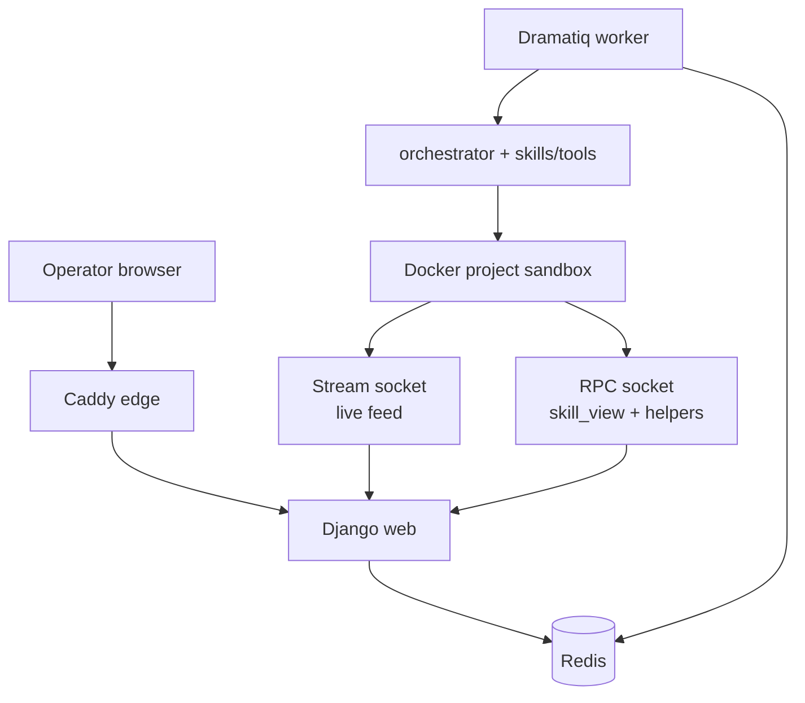
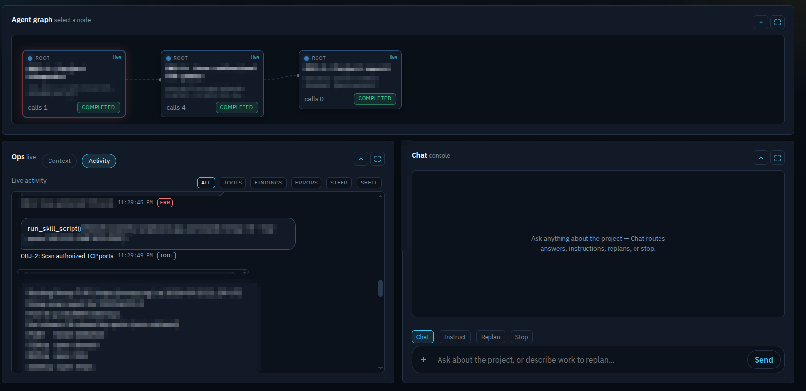
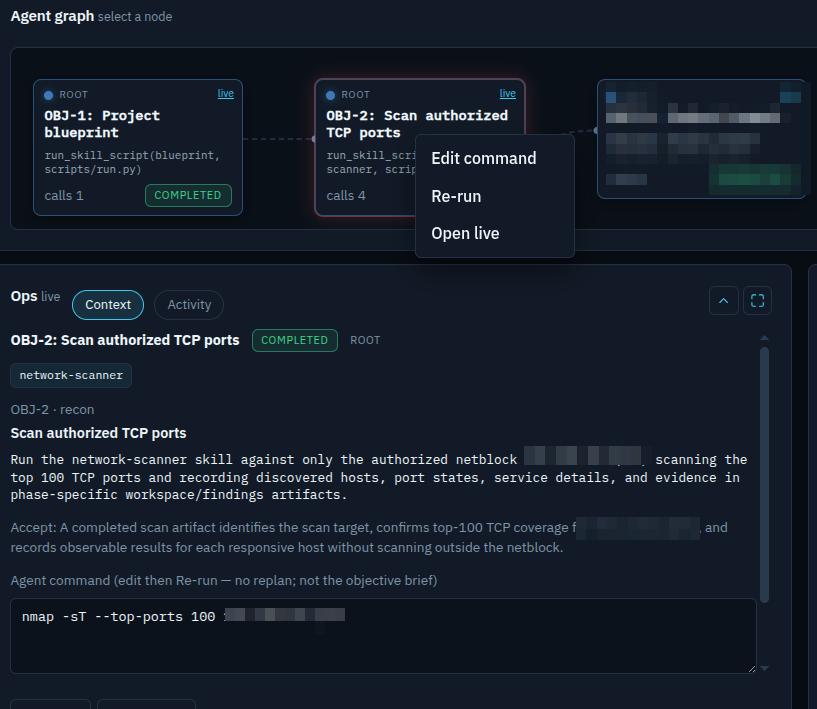
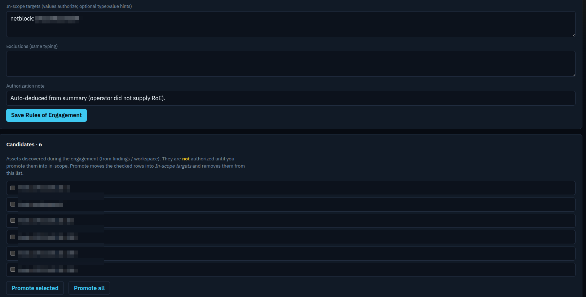
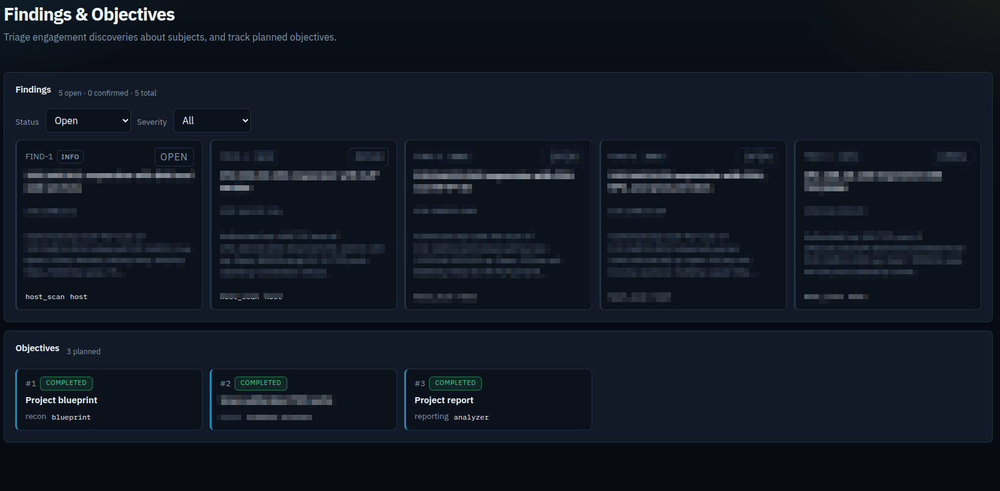
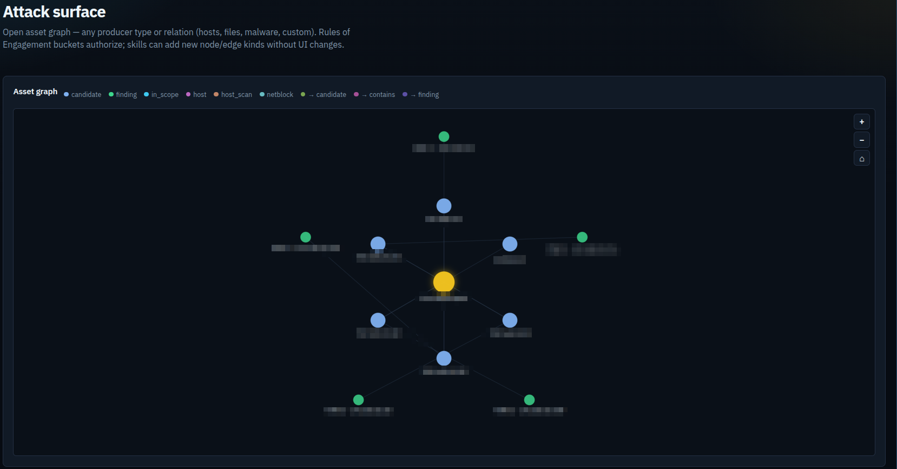
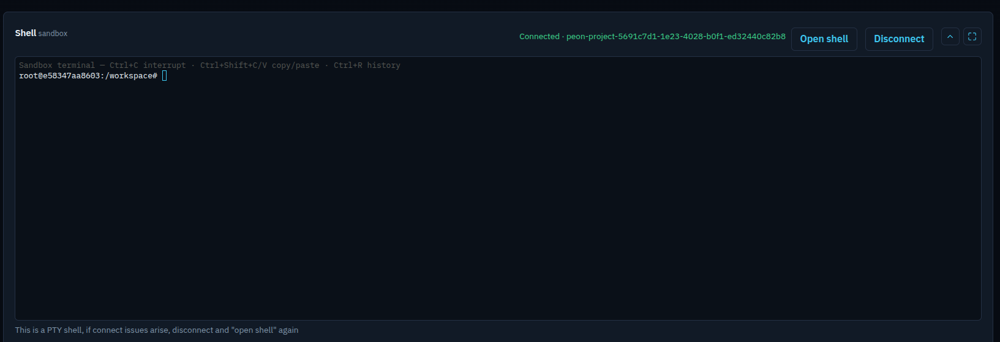
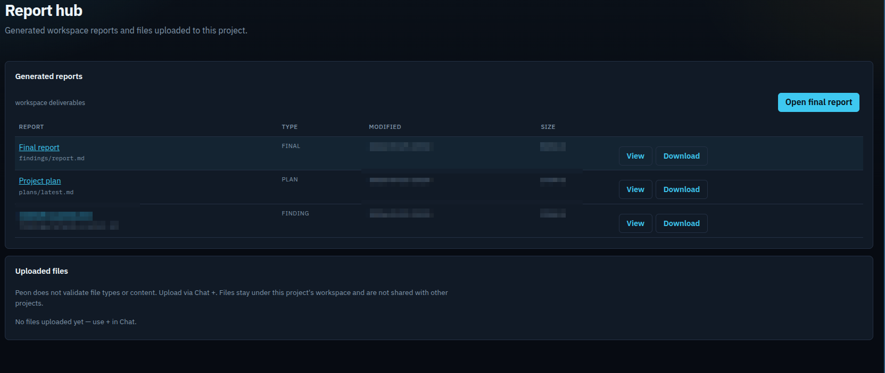

<p align="center">
  
</p>

<p align="center">
  <strong>AI agents runtime</strong> for cybersecurity tasks.<br>
  Prompt → plan → objectives → sandboxed agents.
</p>

> **Disclaimer:** this is still WIP, Bugs are expected.

---

## Overview

Peon turns a modular framwork shipped with Lang-gragh-based agent runtime that turns a prompt into a plan and objectives that (sub) agents execute. Objectives are fulfilled  by agents that are capable  of running  code, tools, and scripts in an **isolated Docker sandbox per project**.

As an operator, you give your prompt with an optional Rules-Of-Engagements, you can also update scope, steer jobs, promote discoveries, triage findings, and take the report. Skills and tools extend as catalog files—not forked app code.

---

## Stack

| Layer | Technology |
|---|---|
| Control plane & UI | **Django** (`peon/`) |
| Agents / planning / skills | **orchestrator/** — LangChain tool-calling |
| LLM | **LiteLLM** (default **OpenRouter**) |
| Job queue | **Dramatiq** + **Redis** |
| Edge | **Caddy** TLS → Django |
| Execution | Per-project **Docker** sandbox |
| Catalogs | `skills/` (Agent Skills) · `tools/catalog/` (YAML) |
| Live feed | Unix **stream** socket (sandbox → UI) |
| Host RPC | Unix **RPC** socket (sandbox → host helpers) |

Compose: `edge` · `web` · `redis` · `worker` (build-only `sandbox` profile for the job image).



---

## Features

- **Plan / replan** — From a brief or console chat; objectives become jobs you can rewrite mid-engagement without restarting from scratch. you can also trigger a re-pan after the project is concluded, analyzer and planner will updates the project accordingly
- **Per-project sandbox** — a sandbox (docker container) is provisioned with the needed tooling when a project is created, toolings (Code, cli-tools, or scripts) and data (findings, intermediate reports and tool dumps) live in that isolated Docker to ensure seperation of projects artifacts. The sandbox is ereased when the project is deleted.
- **Host RPC** — Separate Unix **RPC** socket server runs so sandboxed skill helpers can stream output, log activities or ask the host for catalog data (e.g. `skill_view`).
- **Modular skills & tools** — Add a playbook (`skills/<name>/SKILL.md` + scripts following [Agent Skills](https://agentskills.io)  format) or a CLI package (`tools/catalog/*.yaml`) as data. Planners and agents pick them up without changing Django/orchestrator code.
- **Install cascade** — Required tools for a project are provisioned when an agents require them. Missing CLIs resolve in order: **`tools/catalog` YAML → skill `references/INSTALL.md` → LLM recipe**, then `provision_cli` installs into the bound sandbox. Prefer this over free-form apt/curl via `run_cli`.
- **ToolspProvisioning supported recipes** — Catalog/LLM recipes support the recipes below :
  - **`apt`** — install debian packages via Apt
  - **`github_release`** — if the tools has a released binary in gitub, destination path is `/usr/local/bin`
  - **`git_clone`** — if the tool does not require additional set-up, then clone repo + entrypoint on PATH (pair with apt for the interpreter)
  - **`pip`** — for Python packaged tools
  - **`custom`** — if a custom installation script is needed, a bash can be created as a sibling `{id}.sh`, for more details, check the `tools/catalog`.
  
  Each tool also declares **`verify`** commands; this helps the planner to verify if a tool is broken and it requires at run-time.
- **Toolsmith + install lab** (`/learn/`) — Describe a tool or skill → draft recipe → **spin up a disposable lab sandbox, run the cascade install + verify that it runs on the sandbox** → edit/approve → save to the global catalog before a live project uses it.
- **Project provisioning** — The same cascade runs inside each project sandbox when agents call `provision_cli`, so jobs use real binaries on PATH.
- **Steer** — Instruct live agents, edit/re-run a job command, or open an in-browser PTY into the project sandbox.
- **Rules of Engagement** — Active probes need in-scope values; discoveries stay candidates until you promote them (scope is authorization, not a prompt hint).
- **Parallel agents** — Jobs and nested sub-agents per objective.
- **Findings** — Engagement discoveries based on the objectives. each finding is categories based on severity.
- **Attack surface** — Open asset graph; visualizing seeds, assets and findings
- **Reports** — Analyzer synthesizes workspace evidence into a deliverable.
- **MCP (optional)** — mcp-bridge skill can talk to operator-provided MCP servers **inside the sandbox**. Uses the host RPC bridge only as a helper transport; it is not the live stream.
- **Watchdog** — Scheduled ticks under Rules of Engagement for continuous/long-term skills.

---

## Screenshots

### Dashboard



### Agent context



### Rules of Engagement



### Findings



### Attack surface



### In-browser terminal



### Report hub



---

## How to run

### Prerequisites

- Docker and Docker Compose
- An LLM API key (OpenRouter by default; see `.env.example`)

### Start

```bash
cp .env.example .env
# Set OPENROUTER_API_KEY (or the key for your LLM_PROVIDER)

docker compose up -d --build

# Optional: build the job sandbox image used by projects
docker compose --profile build build sandbox

curl -k -fsS https://127.0.0.1:${WEB_PORT:-8000}/health/
```

UI: **https://127.0.0.1:8000/** (self-signed cert via edge).

### First session

1. Create a **Project** (title, brief, optional in-scope targets / uploads).
2. Plan and start agents from the war room.
3. Watch the live feed; promote **candidates** into Rules of Engagement when accepted.
4. Triage **findings**; use **attack surface** and **report hub** as work lands.

### Useful commands

```bash
docker compose logs -f worker
docker compose down
```

Port busy? Set `WEB_PORT`, `PUBLIC_URL`, and `CSRF_TRUSTED_ORIGINS` in `.env`.

---

## Layout

| Path | Role |
|---|---|
| `peon/` | Django control plane + UI |
| `orchestrator/` | Skills, planning, agent runtime (no Django) |
| `skills/` · `tools/` | Playbooks and CLI catalog |
| `Docker/` · `docker-compose.yml` | Images and Compose stack |

---

## TODOs

- More skills beyond recon / OSINT (web, binary, AD / Entra, …)
- Post-engagement skill-writer trigger, it suggest new skills and tools, reducing cost overtime (operator-vetted)
- Operator webhooks for livefeeds notification
- Sandbox backends beyond local Docker (Kubernetes, remote hosts)
- Stabilize long-running / watchdog jobs
- MCP bridge is broken, needs improvement
- When mature enough, add interface (swagger or mcp) for peon to be used with other tools/agwnts
