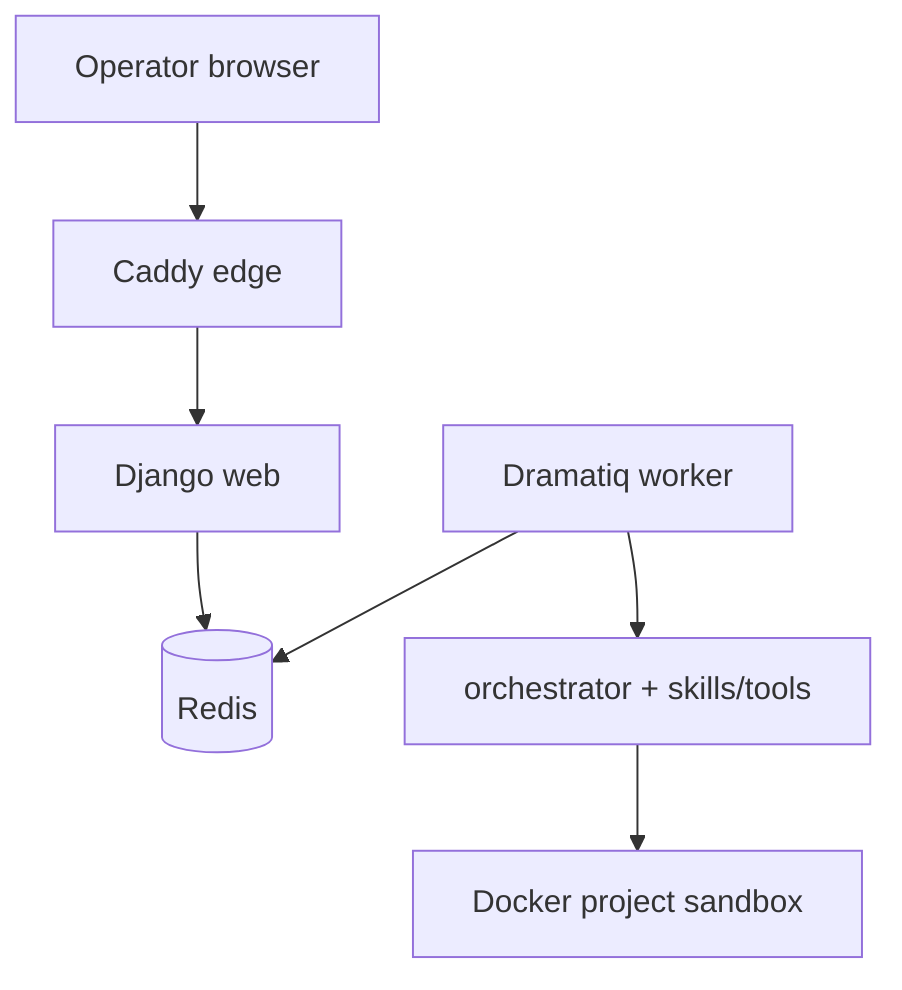

<p align="center">
  
</p>

<p align="center">
  <strong>AI agents runtime</strong> for cybersecurity tasks.<br>
  From a prompt → plan → objectives → sandboxed agents — operator in control.
</p>

> **Disclaimer:** Early-stage and **not stable**. Bugs and breaking changes are expected.

---

## Overview

Peon is an **AI agents runtime** that assists with cybersecurity work. From a single prompt it builds a plan, breaks that plan into objectives for agents to pick up, and runs code, tools, and scripts in **isolated sandboxes** — one sandbox per project.

Agents collaborate under your Rules of Engagement: you authorize scope, steer live jobs, promote discoveries, triage findings, and take the report when the engagement is done. Skills and tools are modular catalogs (`skills/`, `tools/catalog/`), not hard-wired app code.

---

## Stack

| Layer | Technology |
|---|---|
| Control plane & UI | **Django** (`peon/`) |
| Agents, planning, skills runtime | **orchestrator/** library — LangChain tool-calling loops |
| LLM gateway | **LiteLLM** (default: **OpenRouter**) |
| Job queue | **Dramatiq** + **Redis** |
| Edge | **Caddy** TLS → Django HTTP |
| Execution | Per-project **Docker** sandboxes (`peon-sandbox`) |
| Catalogs | Filesystem **Agent Skills** (`skills/`) + YAML tool packages (`tools/catalog/`) |

Compose services: `edge` · `web` · `redis` · `worker` (plus a build-only `sandbox` profile for the job image).



---

## Features

- **Plan & replan** — LLM project plans from a brief; rewrite objectives mid-run from chat or new intel.
- **Live steer** — Instruct running agents, stop/pause, or re-run a job without burning the whole project.
- **Rules of Engagement** — Fail-closed for active probes; promote discovery candidates into scope when you accept them.
- **Sandbox + provisioning** — Install and verify catalog CLIs in the project container before skills run (`provision_cli`).
- **Modular skills & tools** — Drop-in `SKILL.md` playbooks and YAML install recipes; Toolsmith (`/learn/`) drafts them with human review.
- **Parallel agents & sub-agents** — Objectives become jobs that collaborate and nest when useful.
- **Findings board** — Engagement discoveries (not agent status noise), with triage and severity.
- **Attack surface graph** — Open asset graph (any producer type/relation) with the project seed at the center.
- **War-room console** — Live activity feed, HITL chat, and an in-browser sandbox terminal.
- **Report synthesis** — Analyzer path turns workspace evidence into a deliverable report.

---

## Screenshots

### Dashboard


### Agent context


### Rules of Engagement


### Findings


### Attack surface


### In-browser terminal


### Report hub


---

## How to run

### Prerequisites

- Docker and Docker Compose
- An LLM API key (OpenRouter by default; see `.env.example` for OpenAI / other LiteLLM providers)

### Start

```bash
cp .env.example .env
# Set OPENROUTER_API_KEY (or the key for your LLM_PROVIDER)

docker compose up -d --build

# Optional: build the job sandbox image used by projects
docker compose --profile build build sandbox

curl -k -fsS https://127.0.0.1:${WEB_PORT:-8000}/health/
```

Open the UI: **https://127.0.0.1:8000/** (self-signed cert via the edge service).

### First session

1. Create a **Project** (title, brief, optional in-scope targets / uploads).
2. Let Peon **plan** and start agents (or enqueue jobs from the war room).
3. Watch the live board; promote **candidates** into Rules of Engagement when you accept them.
4. Triage **findings**; open the **attack surface** graph and **report hub** as work lands.

### Useful commands

```bash
docker compose logs -f worker
docker compose down
```

Port busy? Set `WEB_PORT`, `PUBLIC_URL`, and `CSRF_TRUSTED_ORIGINS` in `.env` (see `.env.example`).

---

## Layout

| Path | Role |
|---|---|
| `peon/` | Django control plane + operator UI |
| `orchestrator/` | Skills, planning, agent runtime (library; no Django) |
| `skills/` · `tools/` | Playbooks and CLI catalog (data) |
| `Docker/` · `docker-compose.yml` | Images and Compose stack |

---

## Roadmap

- More skills beyond recon / OSINT (web, binary, AD / Entra, …)
- Post-engagement self-enhancement via skill-writer (operator-vetted)
- UI / UX polish and operator webhooks
- Sandbox backends beyond local Docker (Kubernetes, remote hosts)
- Stabilize long-running / watchdog-style jobs
