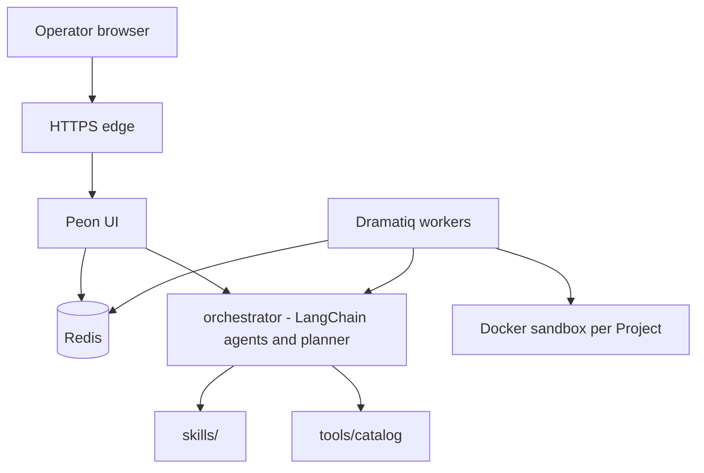

# Peon

> **Disclaimer:** Early-stage and **not stable**. Bugs and breaking changes are expected.

**AI-assisted workbench** for offensive security. You describe an engagement; Peon drafts a plan, scopes it into objectives, and runs them as jobs with LLM-driven agents (in parallel, with sub-agents when needed). It provisions real tools into isolated sandboxes and helps you land findings and a report — while **RoE and approvals stay with the operator**.

---

## Where Peon stands out

Many AI security tools are niche one-offs or a chat window that invents shell and hopes for the best. Peon is an **engagement control plane**: plan → execute → replan → report, with catalogs and sandboxes in the middle.

| Strength | What that means in practice |
|---|---|
| **Replan on the fly** | Failures, new intel, or operator chat can rewrite the project plan mid-engagement. You can also reopen work for re-test, verification, or extending a project. |
| **Live steer + edit/re-run** | Guide running agents, or change a CLI / objective and re-run that job without burning the whole project. |
| **Sandbox + tool provisioning** | Before skills run, Peon installs and verifies **needed catalog tools** in that project’s Docker sandbox — deterministic binaries, fewer hallucinated flags. Agents can also call `provision_cli` mid-run. |
| **Hard RoE, soft discovery** | Active probes need non-empty **in-scope** targets. Hosts, URLs, domains, and other assets found during the run become **candidates**; only the operator promotes them into scope (which can trigger a replan or job re-run). |
| **Modular by design** | Add a skill or tool as **data** (`skills/`, `tools/catalog`) with little or no application code change. Skills wrap native CLIs and/or a `scripts/run.py` playbook inside the sandbox. |
| **Learn (human-in-the-loop)** | From a prompt, Peon drafts a skill or a tool install package. You can **test install on a lab sandbox** before saving to the global catalog. Install recipes support apt, GitHub releases, pip, git clone, and custom bash. |
| **Parallel agents & sub-agents** | Objectives split into jobs handled by collaborating agents and nested sub-agents. |
| **Structured engagement workflow** | Every engagement follows **blueprint → engagement skills → analyzer**. Plan and report are first-class, not a chat dump. |

Also: per-project Docker isolation (shared sandbox optional), findings board with triage, optional MCP bridge, [Agent Skills](https://agentskills.io/home)-compatible `SKILL.md` + scripts, and scheduled **watchdog** ticks under RoE.

---

## How AI fits (without the hype)

Job agents are **LangChain** tool-calling loops. Each job binds only the capabilities listed on that skill’s `allowed-tools` (plus a small sandbox base set: `sandbox_setup`, `sandbox_status`, `provision_cli`, `skills_list`, `skill_view`). Catalog CLIs (nmap, httpx, …) are **not** LangChain tools themselves — agents reach them through `provision_cli`, `run_cli`, and `run_skill_script` inside the project Docker sandbox.

### LangChain capabilities (what the agent can call)

| Group | Capability | Role |
|---|---|---|
| **Sandbox** | `sandbox_setup` | Confirm the project Docker sandbox is bound |
| | `sandbox_status` | Show sandbox mode/name and whether key binaries exist |
| | `provision_cli` | Install/verify a CLI in the sandbox (catalog → skill docs → recipe) |
| | `run_cli` | Run an ad-hoc shell command in the sandbox (RoE applies) |
| **Skills** | `run_skill_script` | Execute `skills/<name>/scripts/…` inside the sandbox |
| | `skills_list` | List jobable skills from the filesystem catalog |
| | `skill_view` | Read a skill’s instructions / metadata |
| **Engagement** | `list_objectives` | List project objectives |
| | `update_objective_status` | Mark objectives pending / in progress / completed / blocked / cancelled |
| | `record_finding` / `record_findings` | Persist one or many findings |
| | `list_findings` | Read findings already on the board |
| **Core** | `spawn_subagent` | Spawn a child job (nested agent) with optional skill ids |
| | `wait_for_subagents` | Poll whether child jobs finished |

Skills declare which of these names they allow. Tags and categories on skills and catalog tools help planning pick the right playbook; they do not invent extra LangChain tools.

MCP (`mcp_ensure`, `mcp_call`, …) is available via the **mcp-bridge** skill (sandbox helpers), not as separate top-level LangChain capabilities above.

### Model and workers

- **LiteLLM** — Provider-agnostic chat client for planning and agents; change model/provider in config, not code.
- **OpenRouter** (default) — Set `OPENROUTER_API_KEY` (or point LiteLLM at OpenAI / another provider) for auto-plan, chat replan, and Learn.
- **Dramatiq + Redis** — Queue and run jobs on background workers so the UI stays responsive while sandboxes execute.

---

## Extend with almost no code

Capabilities live as files, not forks:

- **Tools** — YAML under `tools/catalog/` (install, verify, tags). See `tools/CATALOG.md`.
- **Skills** — Folder with `SKILL.md` + scripts (and optional references). Lint before save.
- **Learn (`/learn/`)** — Describe a tool or skill in plain language → draft → **you edit/approve** → lands in the catalog.

The Django UI (`peon/`) and the planning/skills library (`orchestrator/`) stay separate: extend catalogs first; touch Python only when you need new platform behavior.

---

## How the pieces fit



| Piece | Role |
|---|---|
| `peon/` | Control plane + operator UI |
| `orchestrator/` | Skills, planning, agent runtime, workspace (library) |
| `skills/` · `tools/` | Playbooks and CLI catalog (data) |
| Compose | `edge` · `web` · `redis` · Dramatiq `worker` |

---

## Quick start

```bash
cp .env.example .env   # OPENROUTER_API_KEY (or LiteLLM/OpenAI) for planning / Learn
docker compose up -d --build

curl -k -fsS https://127.0.0.1:${WEB_PORT:-8000}/health/
# UI: https://127.0.0.1:${WEB_PORT:-8000}/
```

First session: create a **Project** → **Plan** (or queue jobs) → watch the live board → promote **candidates** into RoE when you accept them → triage findings. Use **Learn** to add tools/skills with review.

```bash
docker compose logs -f worker
docker compose down
```

Port busy? Set `WEB_PORT`, `PUBLIC_URL`, and `CSRF_TRUSTED_ORIGINS` (see `.env.example`).

---

## Roadmap

- Add more skills other than recon / OSINT ones (web pentest, binary analysis, AD/EntraID enums, …)
- Self-enhancement after completed projects: analyzer extension that uses `skill-writer`  to create new/update  existing skills (vetted by the Operator)[Hermes Agent](https://github.com/nousresearch/hermes-agent))
- UI / UX polish
- Webhooks for operator bots (status, errors, updates)
- Sandbox backends beyond local Docker — first targets: Kubernetes and remote SSH / fleet hosts (Axiom-inspired)
- Stabilize long-running / cron-style jobs (watchdog)
